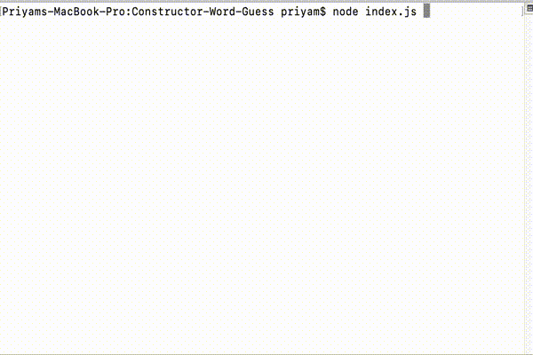

# Constructor-Word-Guess

## 1. Problem Statement

**Word Guess Game** using constructors is a command line game that takes in the letter as user input and updates the word output.

This game is guessing the name of the movie.

If the letter is in the word, the word updates and if the letter in not in the word, number of guesses left reduces by 1.

If all the letters in the word are guessed, the game is Won.
If the number of guesses left are zero, the game is lost.

## 2. Organisation

* **index.js** This file has the following functionalities,
 Create a random word from word.txt file.
 Use Inquirer to ask the letter from the user.
 Check whether the letter is in the word or not.
 If the letter is in the word, update the word and console log the output.
 If the letter is not in the word, reduce the gusses left by 1. Total guesses available are 10.
 Once the word is guessed or total guesses are zero, update the user with game Won or Lost.
 Don't allow letter to repeat.

* **word.js** This file contains the constructor Word, which calls Letter constructor for each letter in the word. Methods to show or update the word as per user input.

* **letter.js** This file contains the constructor Letter which checks or updates the letter value as per user input.

* **word.txt** This file contains all the words that are used as a random word for the game.

## 3. Working Commands

To start the game, run *node index*

## 4. Demo

## 5. Technologies Used

### Package dependencies

* **fs (File Storage)**
* **Inquirer**
* **Chalk**

## 6. Role

This app is completely developed by me.

